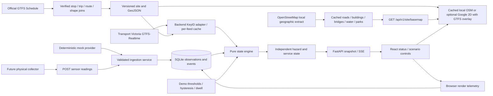

# Architecture and operational boundaries

The user-facing model has two independent dimensions. Mock water only changes hazard; official transport reports change service. No vehicle marker is never evidence of suspension. An empty fresh alert feed means no relevant disruption was reported, not that every service is on time. Rainfall is optional context and cannot establish standing water.

The keyless map draws a cached OpenStreetMap extract as SVG beneath the verified GTFS overlays. The geographic features supply recognizable local street, building, bridge, river and park context; they do not determine hazard or service state. The cache covers the selected Southbank area, while the full Route 58 overview retains GTFS geometry outside that local coverage. The map displays OpenStreetMap contributor attribution and links to its ODbL terms. An optional restricted Google Maps browser key enables Google's basemap separately; live Google rendering still requires its own validation.

The engine is a pure function of reading, transport snapshot, configuration, time and explicit transition memory. It has no network or map dependency. The runtime evaluates once per second, writes transitions and broadcasts the same snapshot to connected browsers. A bounded SSE queue drops superseded snapshots for slow clients instead of growing without limit.

All mock and physical readings pass the same Pydantic model and ingestion/persistence service. The collector endpoint accepts only `source: physical`; it cannot impersonate the internal mock. The server owns `receivedAt`, validates timezone/bounds/clock skew and preserves diagnostic codes without raw rejected values. Reading IDs are idempotent; conflicting reuse is rejected. Late physical observations are retained without replacing the newer current observation.

Realtime requests are made once by the backend, default 60-second cycle, with three feed requests and at most one bounded retry per feed. Timeout is eight seconds per attempt. Authentication errors are not retried; transient errors back off. Last good records are retained but marked stale after failures. Freshness checks feed time and fetch time independently; a fresh endpoint does not refresh another endpoint. Differential feeds are rejected because partial update merge semantics are not implemented.

SQLite stores observations, event records, cached public transport data and browser latency samples. A browser reload reconnects to the existing server scenario. A server restart starts a new normal-steady run and restores historical observations/transport cache as stale until refreshed. This is an intentional single-process prototype; multiple Uvicorn workers would create divergent scenario runtimes and are unsupported.

No secret enters API responses. The Maps browser key is separate and restricted. Same-origin write checks, optional collector/admin Bearer tokens, bounded requests and loopback binding limit the local surface. A public deployment additionally needs authenticated access, rate limiting, HTTPS and a persistent volume.
